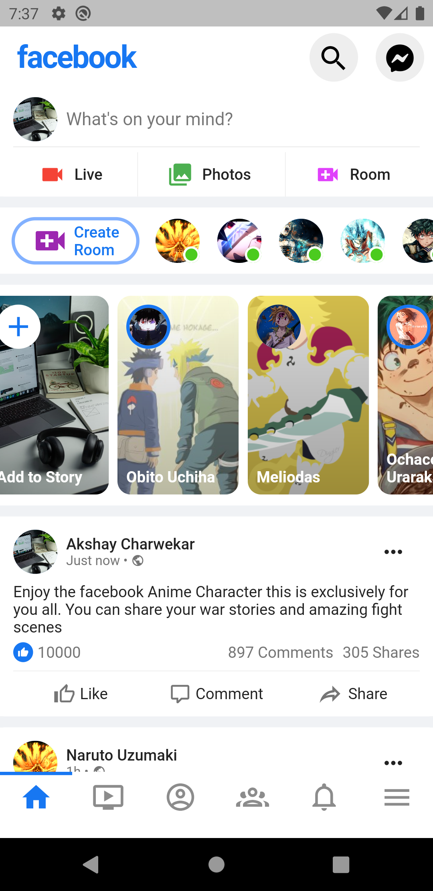

# Facebook Clone
    This project is made to show the power of Flutter. How we can implement interactive modern looking
    website and mobile application from single repository.

## Description
    This project is made for learning purpose only with the help of [Marcus Ng's YouTube video](https://youtu.be/HvLb5gdUfDE). I have added data for the Anime fans. I have tried to implement 
    facebook UI visuals which is almost similar to actual app. I will take this project further and make it functional. As of now we have a android application and web application that runs perfectly fine on any browser.

## Looks
    
    Format: 
    
    Format: 

    I have added videos in 
